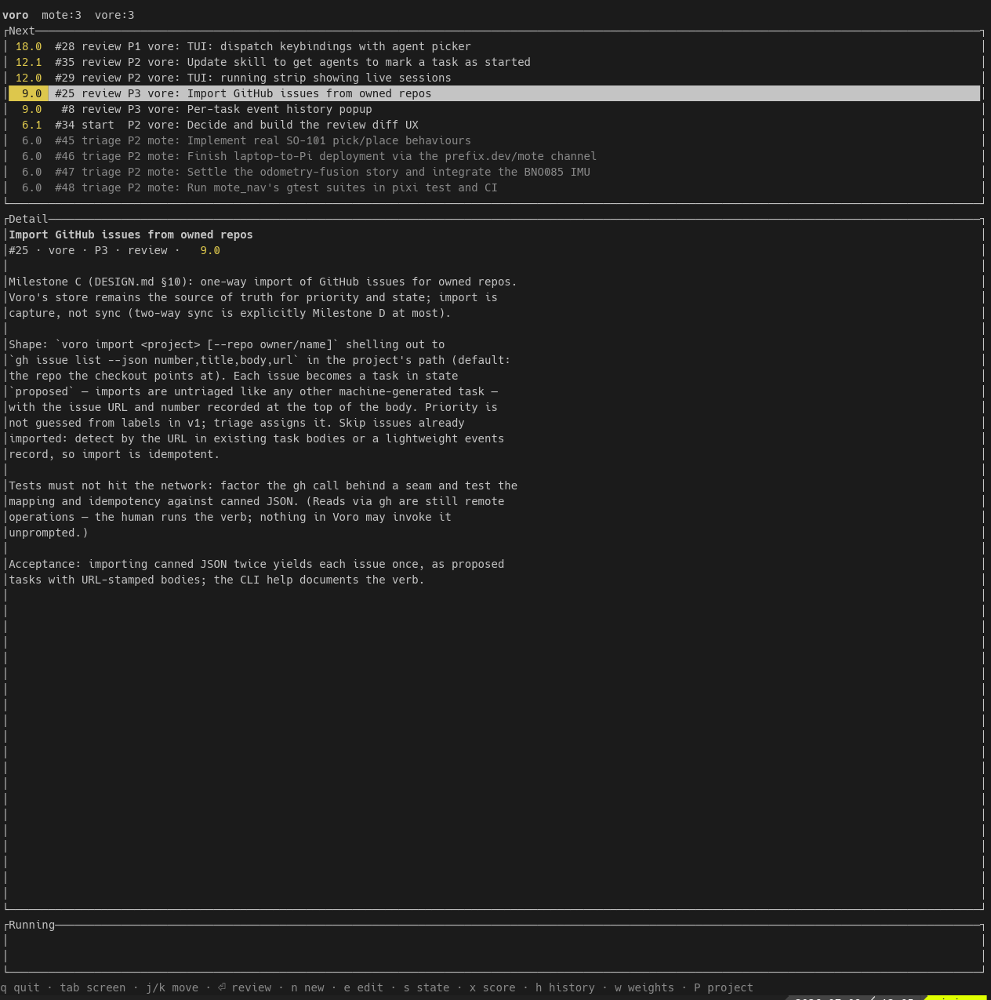

# Voro

A local command centre for AI-assisted development across many projects. Voro
tracks tasks per project, weights each project by how much it matters *today*,
and answers one question: **where should my attention go right now?**

A single **next-action queue** drives everything: questions, reviews, and
proposals that need a human first, then the highest-scoring ready tasks across
all projects — each body written as a prompt, ready to dispatch to a coding
agent.

**Status:** early development. The cockpit, CLI, and dispatch loop work
end-to-end. Expect churn.



## Design

The full design lives in [`docs/DESIGN.md`](docs/DESIGN.md) — concepts, schema,
task state machine, scoring, and dispatch semantics. Agent contributors should
read [`CLAUDE.md`](CLAUDE.md) first.

## Building

Rust workspace: `voro-core` (store, scheduler) and `voro` (ratatui TUI).

```bash
cargo build --workspace
cargo test --workspace
cargo run -p voro
```

## Dispatching to agents

Voro dispatches a task by running a shell command template per agent, and ships
with built-in `claude` and `codex` agents, so with one of those on your `PATH` a
fresh install dispatches with no configuration: `voro dispatch <task-id>` (or the
dispatch key in the TUI) launches a headless session on a ready task. The agent
reports back through the return-path verbs (`voro ask/done/propose`), and its work
lands in `review` where `voro open` or `voro pr` puts the diff in front of you.

To extend or override the built-in agents and viewers, layer a
`~/.config/voro/voro.toml` on top (`voro agent init` writes a skeleton). The
dispatch semantics, the review action, and the `voro.toml` format are covered in
[`docs/DESIGN.md`](docs/DESIGN.md) §8; the `CLAUDE.md`/`AGENTS.md` return-path
snippet and the Claude Code hooks configuration are in
[`docs/agent-integration.md`](docs/agent-integration.md).

## License

Licensed under either of [Apache License 2.0](LICENSE-APACHE) or
[MIT license](LICENSE-MIT) at your option.

Unless you explicitly state otherwise, any contribution intentionally submitted
for inclusion in this work shall be dual licensed as above, without any
additional terms or conditions.
