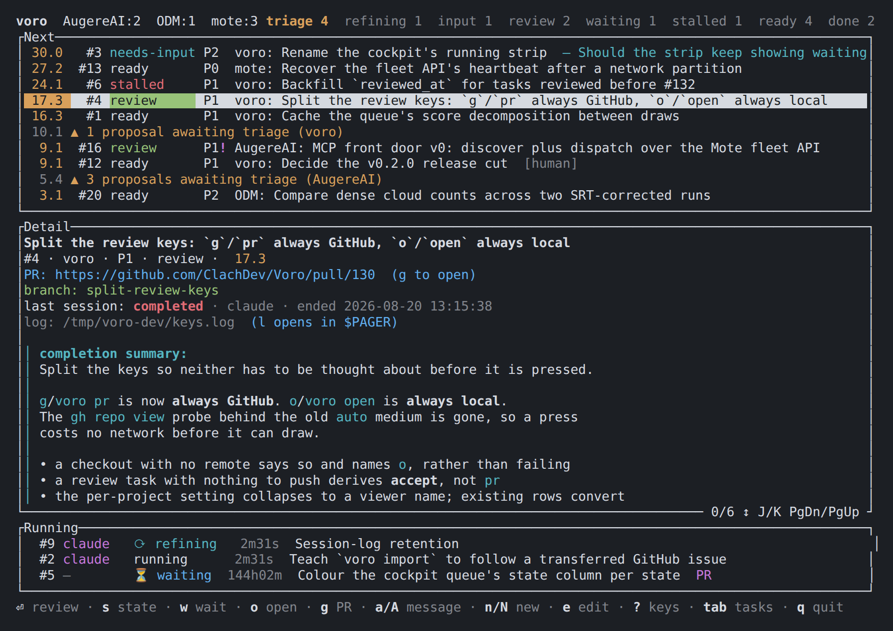
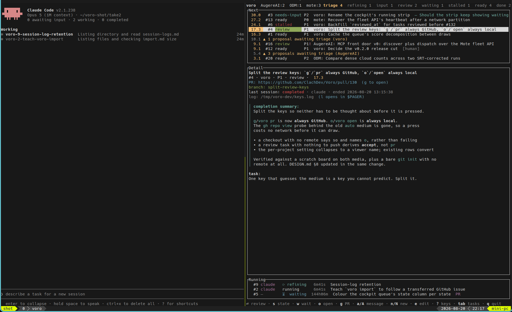

# Voro

[](https://github.com/ClachDev/Voro/actions/workflows/rust.yml)
[](https://crates.io/crates/voro)
[](https://docs.rs/voro-core)
[](LICENSE-MIT)

An attention based session manager for AI-assisted development across many
projects. Voro tracks tasks per project, weights each project by how much it
matters *today*, and answers one question: **where should your attention go right
now?**

A single **next-action queue** drives everything: questions, reviews, and
proposals that need a human first, then the highest-scoring ready tasks across
all projects — each body written as a prompt, ready to dispatch to a coding
agent.

**Status:** early development. The cockpit, CLI, and dispatch loop work
end-to-end. Expect churn.



## Install

Voro is Unix-only — Linux and macOS. It installs a single binary, `voro`, that is
both the TUI cockpit (run with no arguments) and the CLI (`voro <verb>`).

Prebuilt binaries are published for two targets only: `x86_64-unknown-linux-gnu`
and `aarch64-apple-darwin`, which is to say 64-bit Intel and AMD Linux and Apple
Silicon macOS. Every other Unix — an Intel Mac, an ARM Linux box — is supported
by building from source, covered at the end of this section.

On one of those two platforms, the quickest path is the prebuilt shell
installer, which downloads the right binary and drops it in Cargo's bin
directory (`~/.cargo/bin`):

```bash
curl --proto '=https' --tlsv1.2 -LsSf https://github.com/ClachDev/Voro/releases/latest/download/voro-installer.sh | sh
```

If you have never installed Rust, `~/.cargo/bin` is unlikely to be on your
`PATH`, and the shell will not find `voro` afterwards. Add the directory to your
shell's `PATH` and start a new shell.

Prefer to place the binary yourself? Each [GitHub
Release](https://github.com/ClachDev/Voro/releases) also carries tarballs for
those same two targets alongside their checksums. Download one, extract it, and
put `voro` on your `PATH`.

To build and install from source instead — and on any platform without a
prebuilt binary, this is the way in — you need Rust 1.88 or newer:

```bash
cargo install voro
```

## Quickstart

Voro is driven from its TUI cockpit. Launch it by running `voro` with no
arguments:

```bash
voro
```

The cockpit has four screens — **Cockpit** (the next-action queue), **Tasks**
(every task), **Projects**, and **Config**, which lists the agents Voro will
dispatch to with the command each one runs, the viewers it opens diffs in, and
the path of the `voro.toml` they were resolved from. `tab` cycles between them
and `1`–`4` jump straight to one; `j`/`k` move the selection, and the footer
always shows the keys that apply to what you have selected. The walkthrough
below drives one task from nothing to a reviewed diff.

**1. Register a project.** A first launch against an empty database already
opens on the Projects screen — `tab` is the way there any other time. Press `a`
to add one — Voro asks for a name and a path. Press `0`–`5` on a project to set
its weight: the higher the weight, the harder that project's tasks pull toward the
top of the queue.

**2. Create a task.** From the Cockpit or Tasks screen, press `n` and type one
line saying what you want — ⏎ hands it to an agent in the background, which
expands it into a title and a body and files the task for you. The cockpit never
goes away and nothing waits: the proposal turns up in the queue a refresh or two
later, ready for the triage step below. Press `N` instead to plan the task in an
interactive session, when one line is not enough and you would rather talk it
through, or `ctrl-n` to write the whole thing out by hand in your `$EDITOR` —
the rare path, and the only one that sets the state, priority, agent and
blockers at creation time. Its `state:` line decides where the task lands: it
starts at `ready`, so a template saved unedited joins the queue as ready work
straight away — set it to `proposed` instead to route the task through triage,
or to `parked` to file it without it competing for attention yet.

However the task arrives, **the body you end up with is the prompt** the
dispatched agent receives, so it is worth being written like one — by the
proposing agent here, and improvable with the refine keys below before you
dispatch it.

**3. Triage it into the queue.** A proposal — a task you created with `state:
proposed`, or one an agent filed with `voro propose` — needs a verdict from you
before anything can work it. Proposals never take a queue slot each: they collapse
into one digest row per project, so the first `enter` lands on that digest and the
footer reads `⏎ expand`, folding it open to list the proposals underneath. Move
down onto the proposal itself and the footer reads `⏎ triage`; `enter` there opens
a menu of the three verdicts — `triage → ready` accepts it into ready work,
`triage → parked` sets it aside, and `triage → rejected` closes it out. The queue
always floats items that need you first (a question shows `⏎ resume`, a finished
task shows `⏎ review`) above the highest-scoring ready tasks.

When a proposal is worth keeping but badly written, refine it rather than ruling
on it. Refine is not a verdict, so it is not one of the menu's outcomes — it is a
key you press over the row itself: `r` sends the task to an agent to rewrite the
body against a one-line note about what is wrong (`voro triage <id> refine --note
"..."` on the CLI), and `R` opens an interactive session to talk the body into
shape. Either way the task stays a proposal, marked `↻ refined`, so you triage the
improved version next pass.

**4. Dispatch it to an agent.** Select a ready task and press `d` to hand it to
the default coding agent, or `D` to choose which agent. Voro launches a headless
session; the agent works against the task body and reports back through the
return-path verbs (`voro ask` / `voro done` / `voro propose`), which are wired up
per [`docs/agent-integration.md`](docs/agent-integration.md). Those verbs are the
agent's interface, not yours.

**5. Review what lands.** When the agent calls `done`, the task moves to
`review` and rises to the top of the queue, and its detail card leads with the
agent's completion summary — what it says it changed and how it verified.
Press `o` to open its checkout in a viewer, or `g` to open its pull request
(creating it when the project reviews through GitHub). The viewer needs no
setup: Voro ships with `code`, `cursor` and `zed` built in and opens the first
one on your PATH; if none of them is there, `o` opens a small form to name the
editor you do use instead. With the account and the diff in front of you, press
`enter` (`⏎ review`) to accept or reject the work; rejecting with a note
re-dispatches the agent to address it.

Other keys worth knowing on a selected task: `s` change state, `x` the score
breakdown, `h` its history, `e` edit, `l` the session log, and `q` to quit.

## Design

The full design lives in [`docs/DESIGN.md`](docs/DESIGN.md) — concepts, schema,
task state machine, scoring, and dispatch semantics. Agent contributors should
read [`CLAUDE.md`](CLAUDE.md) first.

## Building

Rust workspace: `voro-core` (store, scheduler) and `voro` (ratatui TUI).

```bash
cargo build --workspace
cargo test --workspace
cargo run
```

## Dispatching to agents

Voro dispatches a task by running a shell command template per agent, and ships
with built-in `claude` and `codex` agents, so with one of those on your `PATH` a
fresh install dispatches with no configuration: `voro dispatch <task-id>` (or the
dispatch key in the TUI) launches a headless session on a ready task. The agent
reports back through the return-path verbs (`voro ask/done/propose`), and its work
lands in `review` where `voro open` or `voro pr` puts the diff in front of you.
Viewers work the same way: `code`, `cursor` and `zed` are built in and probed on
`PATH`, so `voro open` needs no configuration either. `voro agent list` and
`voro viewer list` show the effective sets and where each entry comes from.



To extend or override the built-in agents and viewers, layer a
`~/.config/voro/voro.toml` on top (`voro agent init` writes a skeleton). The
dispatch semantics, the per-project viewer, and the `voro.toml` format are covered in
[`docs/DESIGN.md`](docs/DESIGN.md) §8; the `CLAUDE.md`/`AGENTS.md` return-path
snippet and the Claude Code hooks configuration are in
[`docs/agent-integration.md`](docs/agent-integration.md).

## Claude Code plugin

Voro ships a Claude Code plugin — the `voro-cli` skill — so any coding session
can create, propose, and transition Voro tasks through the CLI. Register this
repo as a plugin marketplace once, then install the plugin:

```bash
claude plugin marketplace add ClachDev/Voro
claude plugin install voro
```

The skill then activates in **any** project you open in Claude Code, not just a
Voro checkout — it teaches the agent the read/write verbs, the database
resolution rules, and how to file follow-up tasks against the right project. The
`@marketplace` suffix (`claude plugin install voro@voro`) is only for
disambiguation when several marketplaces expose a plugin named `voro`; the plain
name works here.

Contributors working from a local clone can point the marketplace at the
checkout instead of GitHub:

```bash
claude plugin marketplace add /path/to/Voro
```

## License

Licensed under either of [Apache License 2.0](LICENSE-APACHE) or
[MIT license](LICENSE-MIT) at your option.

Unless you explicitly state otherwise, any contribution intentionally submitted
for inclusion in this work shall be dual licensed as above, without any
additional terms or conditions.
