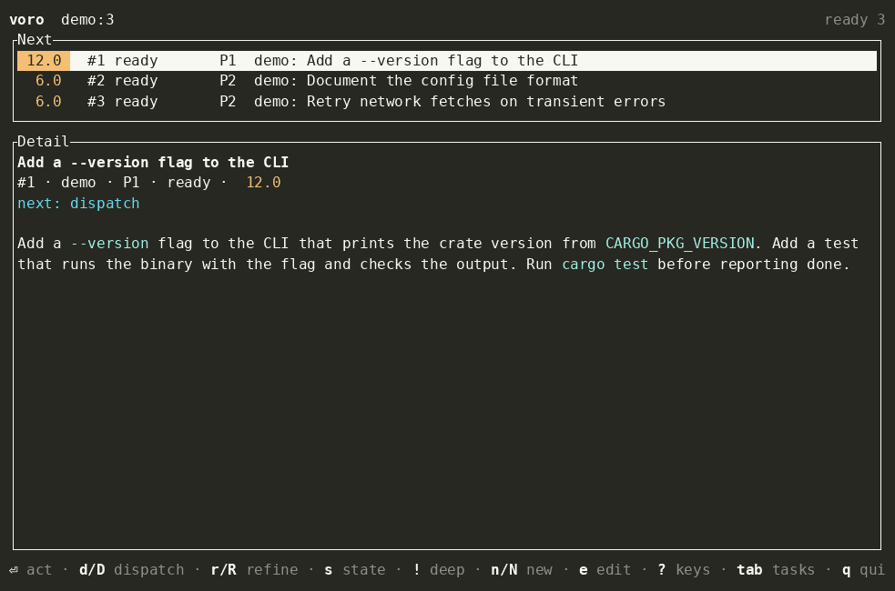
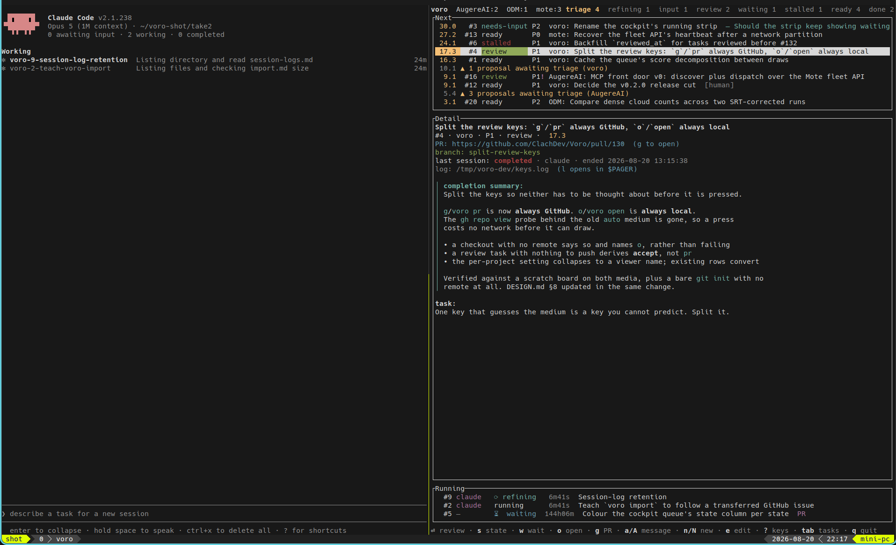

# Voro

[](https://github.com/ClachDev/Voro/actions/workflows/rust.yml)
[](https://crates.io/crates/voro)
[](https://docs.rs/voro-core)
[](LICENSE-MIT)

Four coding-agent sessions across three repositories, and nothing that says
which one is waiting on you. A terminal multiplexer shows the sessions; an
issue tracker holds the tasks; neither ranks what needs a human next.

Voro is a personal cockpit for working with coding agents. It keeps one
**next-action queue** across every project you register: questions agents have
asked, diffs ready to review, proposals waiting for triage, then the
highest-scoring ready tasks. Each task body is written as a prompt, so one key
dispatches it to Claude Code or Codex in a headless session, and the agent
reports back into the same queue when it finishes or gets stuck.

Voro is local and single-operator: one binary, one SQLite file, no server.

**Status:** early development. The cockpit, CLI, and dispatch loop work
end-to-end. Expect churn.



## Install

Voro is Unix-only — Linux and macOS. It installs a single binary, `voro`, that is
both the TUI cockpit (run with no arguments) and the CLI (`voro <verb>`).

Prebuilt binaries are published for two targets: `x86_64-unknown-linux-gnu`
(64-bit Intel/AMD Linux) and `aarch64-apple-darwin` (Apple Silicon macOS).
Every other Unix, an Intel Mac included, builds from source; see the end of
this section.

On one of those two platforms, the quickest path is the prebuilt shell
installer, which downloads the right binary and drops it in Cargo's bin
directory (`~/.cargo/bin`):

```bash
curl --proto '=https' --tlsv1.2 -LsSf https://github.com/ClachDev/Voro/releases/latest/download/voro-installer.sh | sh
```

If you have never installed Rust, `~/.cargo/bin` is unlikely to be on your
`PATH`, and the shell will not find `voro` afterwards. Add the directory to your
shell's `PATH` and start a new shell.

Prefer to place the binary yourself? Each [GitHub
Release](https://github.com/ClachDev/Voro/releases) also carries tarballs for
those same two targets alongside their checksums. Download one, extract it, and
put `voro` on your `PATH`.

To build and install from source, the only path on a platform without a
prebuilt binary, you need Rust 1.88 or newer:

```bash
cargo install voro
```

Dispatch needs a coding agent on your `PATH`: `claude` (Claude Code) or `codex`.
Both are built in and need no configuration.

## First dispatch

Everything below happens in the cockpit. Launch it by running `voro` with no
arguments:

```bash
voro
```

A first launch opens on the Projects screen. `tab` cycles the four screens
(Cockpit, Tasks, Projects, Config), `j`/`k` or a click moves the selection,
and the footer lists the keys that apply to the selected row. `?` opens the
full key map.

**1. Register a project.** On the Projects screen press `a`; Voro asks for a
name and the path to a checkout. The project starts at weight 3 — the
higher the weight, the harder its tasks pull toward the top of the queue.

**2. Create a task.** `tab` to the Cockpit and press `n`. Type one line saying
what you want and press ⏎. A background agent expands the line into a title
and a body written as a prompt, and files it as a proposal; it appears in the
queue a refresh or two later. (`ctrl-n` writes the task by hand in your
`$EDITOR` and lands it in the queue directly; `N` plans it with an agent in
an interactive session first.)

**3. Accept it.** Select the proposal and press ⏎; choose `triage → ready`.
If the body is not quite right, `r` has an agent rewrite it against a
one-line note from you instead.

**4. Dispatch it.** With the ready task selected, press `d`. Voro launches a
headless session in the project's checkout, prepends the return-path verbs
to the task body, and shows the session in the running strip at the bottom of
the Cockpit. The agent works in its own git worktree. If it needs a decision
it calls `voro ask`, and the task rises to the top of the queue as `⏎ resume`;
`A` drops you into the session to answer, `a` sends one line without leaving
the cockpit.

**5. Review it.** When the agent calls `voro done` the task rises to the top
of the queue as `⏎ review`, with the agent's summary of what changed and how
it was verified. `o` opens the diff in your editor (`code`, `cursor` and `zed`
are detected on `PATH`); `g` opens the pull request, creating one from the
summary if none exists. ⏎ accepts or rejects. Rejecting with a note sends the
agent back to work; accepting completes the task. Voro merges nothing — the
work lands when you merge the branch or the PR.

That is the loop. The queue is the only screen you need to watch: whatever is
on top is the next thing that needs you.

Past the first dispatch, the keys that earn their place: `0`–`3` sets a
task's priority and `0`–`5` a project's weight (0 parks the project); `x`
shows why a task scored where it did; `c` links documents the agent should
read before starting; `w` parks a task while you wait on someone else; `h`
shows its history; `l` pages the session log; `s` changes state by hand.
Agents propose follow-up work they notice through `voro propose`, and those
proposals collapse into one digest row per project until you triage them.

## Agents

`claude` and `codex` are built in. Dispatch runs a shell command template per
agent and prepends a preamble to the prompt naming the return-path verbs
(`voro ask`, `voro done`, `voro propose`) with the task's id already
substituted, so a dispatched session needs nothing installed in the project:
no `CLAUDE.md` snippet, no hooks, no configuration.

Sessions you start yourself get the same verbs from the Claude Code plugin,
which teaches the agent the CLI, the database resolution rules, and how to
file follow-up tasks against the right project from any directory:

```bash
claude plugin marketplace add ClachDev/Voro
claude plugin install voro
```

The skill activates in every project you open in Claude Code, not only Voro
checkouts. Contributors working from a local clone can point the marketplace
at the checkout instead: `claude plugin marketplace add /path/to/Voro`.



To add an agent, change a model, or override a built-in, layer a
`~/.config/voro/voro.toml` on top (`voro agent init` writes a skeleton).
`voro agent list` and `voro viewer list` show the effective sets and where
each entry comes from. The template format, the session verbs (attach,
resume, message, stop), and the optional Claude Code hooks that catch a
session which exits without reporting are in
[`docs/agent-integration.md`](docs/agent-integration.md).

## Design

The full design lives in [`docs/DESIGN.md`](docs/DESIGN.md) — concepts, schema,
task state machine, scoring, and dispatch semantics. Agent contributors should
read [`CLAUDE.md`](CLAUDE.md) first.

## Building

Rust workspace: `voro-core` (store, scheduler) and `voro` (ratatui TUI).

```bash
cargo build --workspace
cargo test --workspace
cargo run
```

## License

Licensed under either of [Apache License 2.0](LICENSE-APACHE) or
[MIT license](LICENSE-MIT) at your option.

Unless you explicitly state otherwise, any contribution intentionally submitted
for inclusion in this work shall be dual licensed as above, without any
additional terms or conditions.
